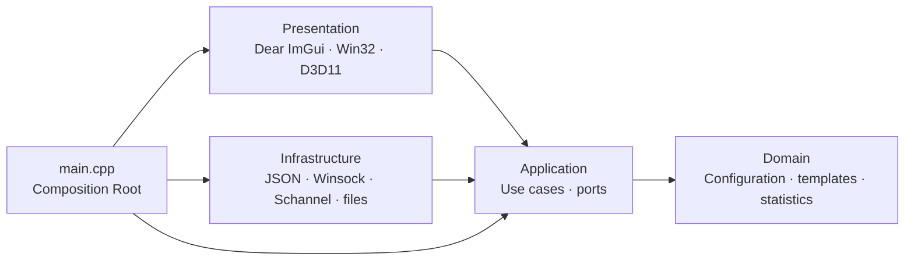
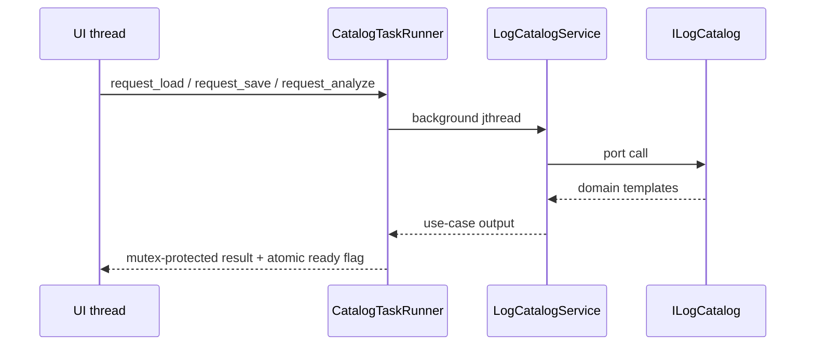

<!-- ARCHITECTURE.md -->
# LogGenerator Architecture

## Dependency rule

모든 소스 의존성은 안쪽을 향합니다. 도메인은 어떤 외부 계층도 알지 못하고, 애플리케이션은 도메인과 자신이 정의한 포트만 사용합니다. 인프라스트럭처와 프레젠테이션은 애플리케이션에 의존하지만 서로 의존하지 않습니다. `main.cpp`만 모든 계층을 조립하는 Composition Root입니다.

CMake도 같은 방향을 `loggen_domain`, `loggen_application`, `loggen_infrastructure` 타깃으로 분리합니다. 애플리케이션과 인프라스트럭처를 하나로 섞은 공용 타깃은 사용하지 않습니다.

## Layer responsibilities

| 계층 | 책임 | 금지되는 의존성 |
|---|---|---|
| Domain | 전송 프로토콜, 생성 설정, 로그 템플릿, 전송 통계 | Application, Infrastructure, Presentation, Windows/GUI/JSON API |
| Application | 설정 검증, 카탈로그 유스케이스, 개인정보 익명화, 템플릿 컴파일·렌더링, 스트레스 테스트 조율, 포트 정의 | Infrastructure, Presentation, Windows/GUI/JSON API |
| Infrastructure | JSON 영속화, 파일 로거, FILE/UDP/TCP/TLS 어댑터, 식별자와 Windows 실행환경 구현 | Presentation |
| Presentation | 입력 DTO 구성, 반응형 ImGui 렌더링, 카탈로그 비동기 작업과 결과 적용, Win32/D3D11 수명 | Infrastructure |
| Composition Root | 실행 경로 결정과 포트–어댑터 결선 | 비즈니스 규칙 구현 |

## Ports and adapters

| Application port | Infrastructure adapter |
|---|---|
| `ILogCatalog` | `JsonLogCatalog` |
| `ILogTransport`, `ITransportFactory` | `UdpTransport`, `TcpTransport`, `SchannelTransport`, `FileTransport`, `TransportFactory` |
| `ILogger` | `AsyncFileLogger` |
| `IExecutionRuntime` | `WindowsExecutionRuntime` |
| `IIdentifierGenerator` | `TimestampIdentifierGenerator` |

영속화 경로는 `JsonLogCatalog` 생성 시 주입되므로 애플리케이션 포트에는 `filesystem`이나 JSON 개념이 노출되지 않습니다. 고해상도 타이머, worker 우선순위와 CPU relax도 실행환경 포트를 통해서만 사용합니다.

## Use cases

`LogCatalogService`는 `ILogCatalogUseCase` 입력 경계를 구현하고 카탈로그 로드·저장, 개인정보 토큰화, 템플릿 분석, 검색 인덱스 생성, 사용자 항목 ID 발급을 조율합니다. UI는 입력 경계에만 의존하며 `PrivacyAnonymizer`, JSON 저장소 또는 ID 생성기를 직접 호출하지 않습니다.

`StressTestService`는 `IStressTestUseCase` 입력 경계를 구현하고 `GeneratorConfig`를 애플리케이션 경계에서 검증·정규화한 뒤 supervisor와 worker를 소유합니다. UI 검증을 우회해 호출해도 잘못된 IP, 프로토콜, 프레이밍, 날짜 범위 또는 오프셋은 거부됩니다.

## Asynchronous boundaries

- `App`은 카탈로그 I/O와 편집기 분석에 각각 `CatalogTaskRunner`를 사용합니다. 각 runner가 worker, 중복 실행 차단, 결과 전달과 종료 join을 단독 소유하므로 JSON과 정규식 처리가 UI thread를 막지 않습니다.
- `StressTestService::request_stop()`은 UI에서 기다리지 않고 stop token만 전달합니다. `stop()`과 소멸자는 supervisor와 worker를 join합니다.
- `AsyncFileLogger`는 제한된 큐와 단일 writer를 소유하며 소멸 시 남은 항목을 비우고 flush한 뒤 join합니다.
- worker는 ImGui, HWND 또는 프레젠테이션 상태에 접근하지 않습니다.

## Resource ownership

- `App`은 Win32 window class와 HWND를 등록 상태와 함께 소유하고 모든 초기화 실패 경로에서 해제합니다.
- ImGui context, Win32 backend, DX11 backend는 각각 별도 준비 상태를 가지며 역순으로 종료됩니다.
- `D3d11Context`는 COM `ComPtr`만 소유하고 종료 시 render target, context, swap chain, device를 명시적으로 해제합니다.
- `SocketHandle`은 Winsock `SOCKET`을 move-only RAII로 관리합니다.
- `SchannelTransport::Impl`은 credential/context handle을 관리하며 재연결 전에 기존 구현 객체를 교체합니다.
- `FileTransport`는 HANDLE을 단독 소유하고 payload 크기와 무관하게 각 slice가 1 MiB를 넘지 않도록 기록합니다.

## Enforced architecture tests

`tests/architecture_tests.cpp`는 다음 규칙을 Release 테스트에서 검사합니다.

- Domain의 외부 계층 및 Windows/GUI/JSON include 금지
- Application의 Infrastructure/Presentation 및 Windows/GUI/JSON include 금지
- Infrastructure와 Presentation의 상호 참조 금지
- 계층별 CMake 타깃 존재와 혼합 core 타깃 부재
- 제품, 테스트, 벤치마크 C++ 파일의 첫 줄 경로 주석과 추가 코드 주석 금지

이 검사는 `scripts/build.ps1`이 실행하는 CTest에 포함됩니다.
